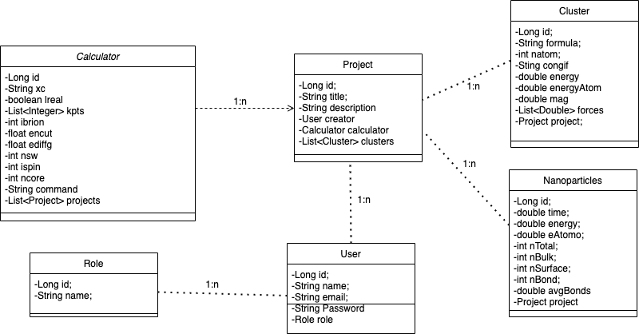

#  🌕🌕🌕 NanoWorld 🌕🌕🌕

---
---

## Final project

### Author : Josefina Cresta

#### Fri, 17 Jun 2022

---

[*Slides* Demo Presentation ](https://slides.com/josefinacresta/dea-aa465a) || [_Notion_ Task Manager](https://crawling-jute-cde.notion.site/14c581b7ba3b447e8cc43dd7f106b27b?v=4343c46f6a84422cbb4155f1bdda6422)

---
This project has users who will have roles (of teachers and students) who will have access to the information of the other models.  the main model is the projects.  which have a title, description, creator (which in the future will be a user, that is, there will be a one-to-many relationship from user to projects).
 In addition, each projector has its calculator, which is personalized for each project.  But the same calculator configuration can be used for different projects.
 And finally each project has its list of structures.  Which can be clusters or nanoparticles.  Each structure will belong to a single project, but a project will have several structures.

 One important thing to note is that deleting a calculator will delete all projects that are related to it.  Since if it is removed it is considered that all the calculations it made are incorrect

---

## User Stories: 

*  As a teacher and researcher it is possible to register in NanoWorld.  Once the registration is done, it is possible to see the information of all the available projects.  Both their own and those of other creators.  In the project details you will find the information on the configuration of the calculator used to perform structural and energy calculations of the nanostructures. the resulting characteristics of the structures associated with each project are also observed. 
  
*  As a student it is possible to create an account and join the NanoWorld to obtain relevant information on calculations carried out in important research groups.  Information can be obtained from this application for theoretical work on data analysis and theoretical predictions of final configurations of nanostructures.
  
* With the teacher role it is possible to create new custom calculators, and attach them to future projects.  or create new empty projects for theirs students to attach the results of assigned calculations as study assessments.
  
* In addition, all nanowolds users can view an important energy graph and from this draw different physical conclusions of nanostructures.  In the future, this graph will allow us to analyze the quality of the calculators and the calculations made.

---

## Technologies Used
   
* SpingBootInizializer
* SpingBootSecurity
* JAVA
* SQL
* MySQL
* IntelliJ

---

## Models
    1. User
    2. Role
    3. Project
    4. Calculator
    5. Cluster
    6. Nanoparticles

        
        
## Server routes table

[http://localhost:5005/swagger-ui.html#/auth-controller](http://localhost:5005/swagger-ui.html#/auth-controller)

| Method | URL | Request header | Request Body | notes |
| --- | --- | --- | --- | --- |
| POST | /auth/signup | — | {name, email,password} |  |
| POST | /auth/login | — | {email, password} |  |
| GET  | /auth/verify | Authorization: Bearer < JWT > | — |  |
| GET | /api/projects | — | — |  |
| GET | /api/projects/{id} | {projectId} | — |  |
| POST | /api/projects | — | {title, description, calculator} |  |
| PUT | /api/projects/{id} | {projectId} | {title, description} |  |
| DELETE | /api/projects/{id} | {projectId} | — |  |
| GET | /api/calculators | — | — |  |
| GET | /api/calculators/{id} | {calculatorId} | — |  |
| POST | /api/calculators | — | {xc,lreal,kpts,ibrion,encut,ediffg,nsw,ispin,ncore,command} |  |
| POST | /api/calculators/toproject | — | {calculatorId} |  |
| DELETE | /api/calculators/{id} | {calculatorId} | — |  |
| GET | /api/clusters | — | — | para el clustersPAge |
| POST | /api/clusters | — | {formula, natoms, energy, forces, magmon, projectId} | Agregar otros atributos terminar |
| DELETE | /api/clusters/{id} | {clusterId} | — | en cada cluster card, poner botoncito de cesto |
|  |  |  |  |  |

# Future Work

More relationships between existing models and new models should be made.
For example between teachers and students, which would be two types of users.

Create project repositories for users.

Improve the declaration of variables of each model.

Add more endpoints for existing and new models.

Carry out test.
## Resources
 
  * - OpenCamp Java Bootcamp Ironhack Lessons by Raymond and Shaun. Thank you very much for your help and support.

- [hibernate-inheritance](https://www.baeldung.com/hibernate-inheritance).
-  [REST API Documentation Templates](https://github.com/jamescooke/restapidocs).

